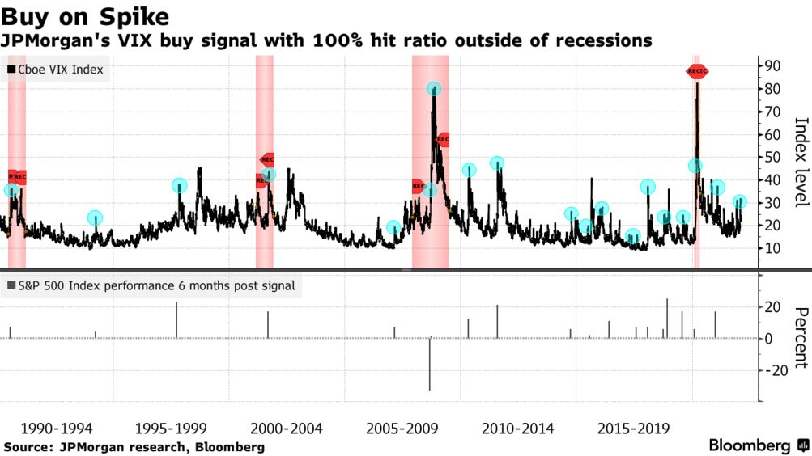

# Bloomberg Article

_image from_ [Bloomberg Article](https://www.bloomberg.com/news/articles/2022-02-08/jpmorgan-strategists-see-sure-fire-sign-it-s-time-to-buy-stocks)

---

 

   
   [Source Code](https://github.com/kelvinkissi/JPM-Trading-Strategy-VIX-S-P500/blob/main/JPM%20Trading%20Strategy%20.ipynb)
   

-----

Cboe Volatility Index: “Benchmark of volatility” is the most recognized measurements of equity volatility widely reported by financial media. It measures the degree of uncertainty in the marketplace on a 30 day moving average of the S&P 500 Index by using Cboe-listed options or SPX options. The prices investors are willing to pay for options usually reflect how much the underlying asset is expected to move over a given time frame. Between 1990 and 2020 the closing range on the VIX has been between 9.14 and 82.69. Higher VIX index suggest more expected uncertainty being priced into the marketplace while lower values indicate less expected uncertainty. The VIX index has an inverse relationship with the S&P 500. 

VIX buy signal has proven 100% accurate outside of recessions
Indicator supports JPMorgan's belief that equities offer upside.
